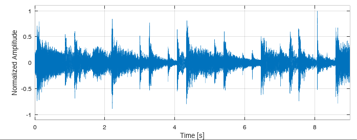
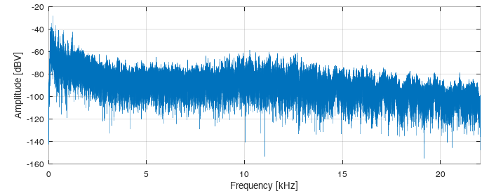
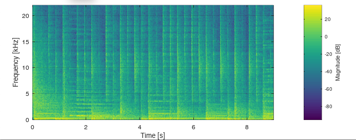
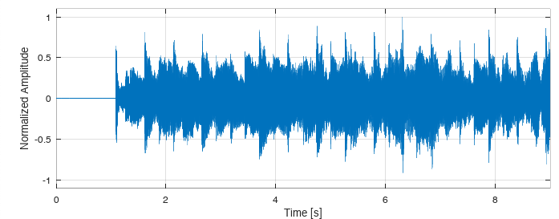
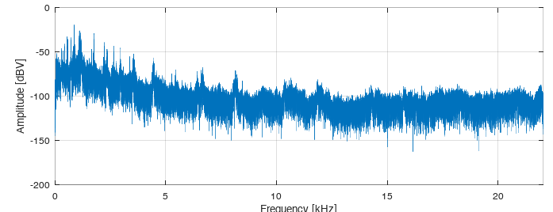
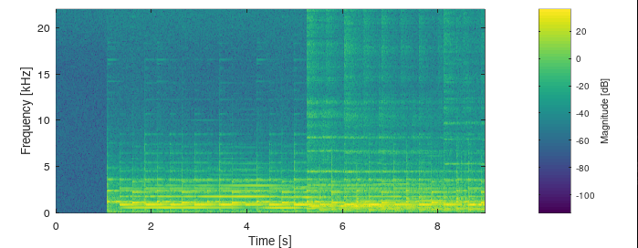

## Step 1
1. Does acoustic communication rely on electromagnetic waves?

	No
2. How fast do acoustic waves travel through the air (estimate)?

	343 m/s
3. When sampling at 10 kHz, what is the resolution that a time-of-flight distance measurement could achieve in theory (estimate, leave out implementation details)?

4. At the same sampling rate, what would be the precision with electromagnetic waves? 

5. What changes if the sampling rate is doubled to 20 kHz instead (for both, acoustic and electromagnetic waves)?

6. What is the typical bandwidth (measured in Hertz) of an acoustic sound that is used in media such as broadcast, television, cinemas, or recorded with a cellphone?

	44100 Hz
7. What is the frequency range at which humans perceive sound (from ... to ..., measured in Hertz)?

	from 100 to 1000 Hz

## Step 2
1. Is MobileComp1 or MobileComp2 more suited to carry the data?

MobileComp1

MobileComp2

2. Which frequencies should be used to encode the data?
	
	The higher frequencies from 4kHz till 20kHz as we humans can't perceive these frequencies and they are not that high in magnitude compared to 2kHz and below when looking at the spectrogram. 
3. Is there a perceivable change of the audio file? Does the sound quality remain?

	In MobComp2 a small change can be perceived and the sound quality is a bit worse (some high distorted sounds are present). The MobComp1 did sound the same as without the embedded message and the quality remains similar. 

## Step 3
1. For both sound files: Are there bit errors?
